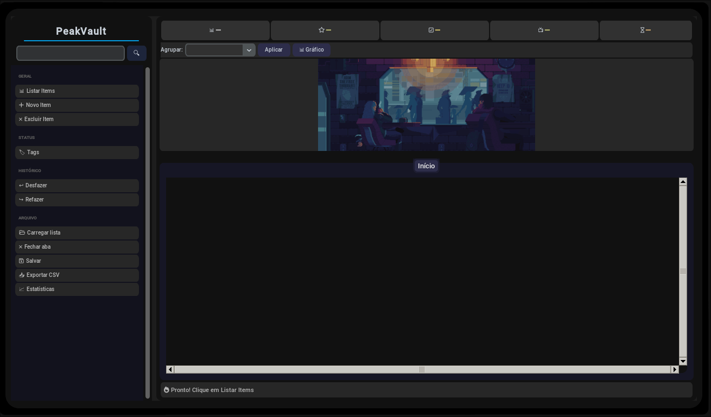
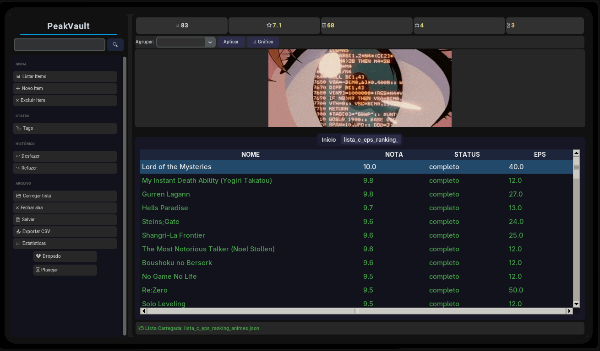
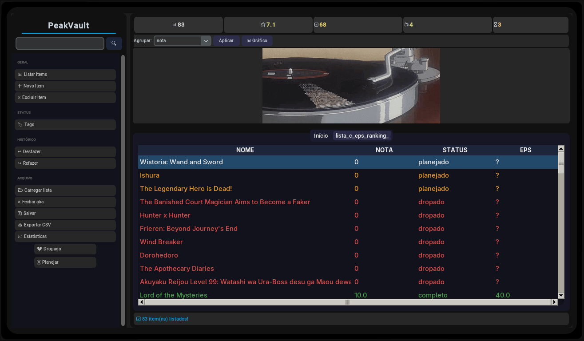
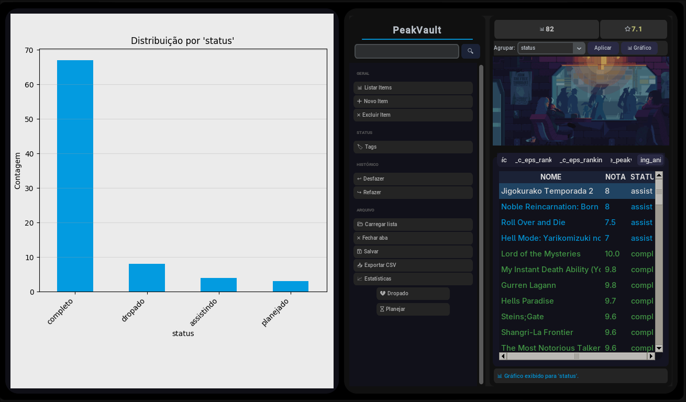
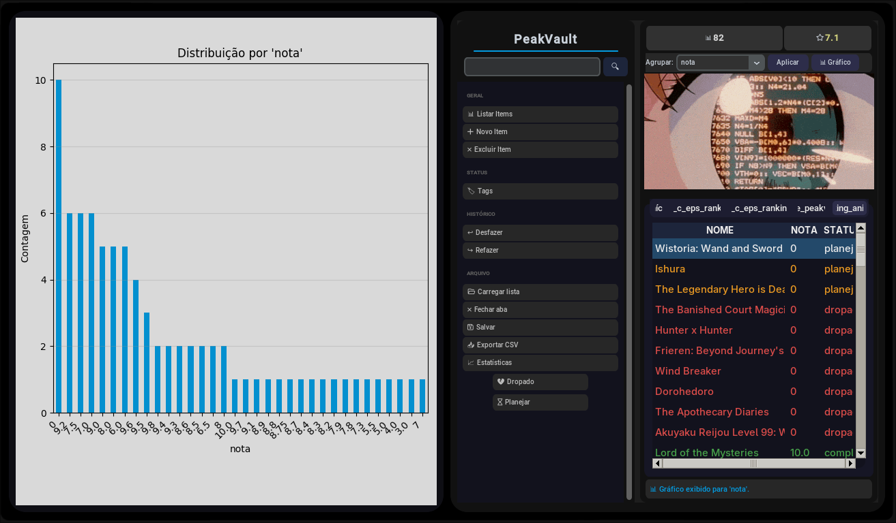

<p align="center">
  <strong>🇧🇷 Português</strong> &nbsp;|&nbsp; <a href="README.en.md">🇺🇸 English</a>
</p>

# PeakVault

<p>
  
  
  
  
  
</p>

Sistema de análise e processamento de arquivos JSON com interface gráfica moderna. CRUD dinâmico, agrupamento de dados e visualização gráfica — adaptável a qualquer lista JSON plana.



---

## Visão Geral

PeakVault é uma ferramenta de produtividade pessoal para gerenciamento genérico de listas JSON planas. Oferece interface gráfica intuitiva para organizar coleções como animes, filmes, jogos ou qualquer conjunto de dados estruturado, com suporte a CRUD completo, agrupamento dinâmico e geração de gráficos.

## Funcionalidades

- **CRUD completo** — Adicionar, editar, excluir e salvar itens com adaptação automática às keys do JSON carregado
- **Carregamento genérico** — Abre qualquer lista JSON plana; os campos de adição se ajustam automaticamente às keys do arquivo
- **Agrupamento dinâmico** — Agrupa dados por qualquer key disponível para análise segmentada
- **Visualização gráfica** — Geração de gráficos Matplotlib com base nos agrupamentos selecionados
- **Pesquisa** — Barra de busca para filtrar itens na lista carregada
- **Feedback visual** — Barra de status com última ação realizada e tratamento de erros em todas as funções

## Tecnologias

| Tecnologia | Finalidade |
|---|---|
| Python | Linguagem principal |
| CustomTkinter | Interface gráfica moderna em tons de azul escuro |
| Pandas | Análise e processamento dos dados JSON |
| Matplotlib | Geração de gráficos |

## Como Usar

1. Instale as dependências:
   ```bash
   pip install customtkinter pandas matplotlib
   ```
2. Execute o script principal:
   ```bash
   python interface.py
   ```
3. Na interface, carregue uma lista JSON via botão "Carregar lista"
4. Utilize os botões à esquerda para CRUD, agrupar ou visualizar gráficos

> Compatível com Windows 10, 11 e Linux.

## Estrutura do Projeto

```
PeakVault/
├── interface.py                              # Interface gráfica (CustomTkinter)
├── logica.py                                 # Lógica de processamento dos dados
├── ranking_animes(sample_json_para_testar).json  # JSON de exemplo para testes
├── assets/                                   # Screenshots do projeto
├── LICENSE                                   # MIT
└── README.md
```

## Screenshots





 

## Limitações

- Projetado para listas JSON planas (sem objetos aninhados)
- Desenvolvido inicialmente para uso pessoal em tracking de animes, filmes e métricas de jogos

## Licença

Distribuído sob licença **MIT**. Consulte o arquivo [LICENSE](LICENSE) para mais informações.

---

Desenvolvido por [Ismael Douglas](https://github.com/ismaeldouglasdev).
